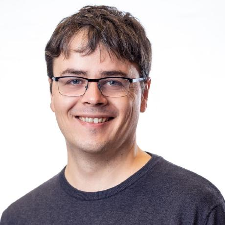

# 2023 OpenTelemetry Governance Committee Candidates

## List of candidates

In alphabetical order:

- [Candidate Name](#candidate-name)

<!--
### Candidate 1

- Company: Company Name
- GitHub: [username](https://github.com/username)
Description of candidate
---
-->

### Austin Parker

- Company: Embargoed until 2nd Week of October
- GitHub: [austinlparker](https://github.com/austinlparker)

Austin Parker is the Community Maintainer of OpenTelemetry and long-term
contributor. They have been involved in the project since inception, and have
been a consistent advocate, organizer, and contributor. Austin has been a
maintainer of the Communications and Demo SIGs, a co-chair and organizer of
Observability Day event at KubeCon EU and NA, has authored two books on
distributed tracing and OpenTelemetry, and is an overall swell person.

If elected, Austin will continue to work on community advocacy, outreach, and
contributor experience. OpenTelemetry is only as successful as it is because of
its community, and the GC's role is to nurture and guide that community. They
will prioritize efforts to increase the contributor and maintainer community
size, ensure that the project is welcoming and inclusive, and to guide the
project towards graduation and long-term success.

### Juraci Paixão Kröhling

- Company: Grafana Labs
- GitHub: [jpkrohling](https://github.com/jpkrohling)

I'm Juraci Paixão Kröhling, a passionate open-source software engineer, and I'm
seeking your support for my re-election to the OpenTelemetry Governing Board. My
commitment to the project runs deep and I have chosen an employer willing to
sponsor my upstream work full time. Since my election in 2021, I've actively
contributed to the OpenTelemetry project and the wider observability community.
Here are some concrete examples of what I've accomplished during my tenure
2021-2023:

* Established the joint GC/TC call as an avenue for communication between the
  two groups
* Helped make the project more popular by talking about it at podcasts,
  conferences, and other similar events
* Attended the first in-person OTel leadership summit, discussing current
  challenges to the project and what we can do to overcome them
* Mediated conflicts, with the goal of keeping the OTel community welcoming to
  new members
* Actively proposed, reviewed, and voted on changes to the project
* Coordinated the participation of the OpenTelemetry project in the
  [Outreachy](https://www.outreachy.org/) internship programs, successfully
  recruiting mentors among the OpenTelemetry maintainers
* Volunteered to be a sponsor for the SIG Security, taking an active
  participation there
* Connected people from different parts of the community based on the broader
  community view I obtained as being part of the board

As an engineer, I’m active in communities around the SIG Collector, where I’m an
[approver in the
core](https://github.com/open-telemetry/opentelemetry-collector#contributing)
repository, and [maintainer in the
contrib](https://github.com/open-telemetry/opentelemetry-collector-contrib/#contributing)
repository, being the author or code owner for several components, including the
[load-balancing
exporter](https://github.com/open-telemetry/opentelemetry-collector-contrib/tree/main/exporter/loadbalancingexporter#trace-idservice-name-aware-load-balancing-exporter)
and [tail-sampling
processor](https://github.com/open-telemetry/opentelemetry-collector-contrib/tree/main/processor/tailsamplingprocessor#tail-sampling-processor),
which together allow open-source users to achieve a scalable tail-sampling
deployment without getting locked-in with specific vendors. I’m also the creator
of the [OpenTelemetry Operator for
Kubernetes](https://github.com/open-telemetry/opentelemetry-operator), having
successfully fostered a community around it that is able to continue evolving
further even after I stepped back from maintainership to focus on other OTel
areas. Overall, I’m very proud of my contributions to the project, placing me
among the [top 10
contributors](https://opentelemetry.devstats.cncf.io/d/9/developer-activity-counts-by-repository-group-table?orgId=1&var-period_name=Last%202%20years&var-metric=contributions&var-repogroup_name=All&var-country_name=All)
to the project since the last election.

My commitment to the project and the wider observability community goes beyond
the technical contributions: I was part of the [Program Committee for
several](https://www.credly.com/users/juraci-paixao-krohling/badges) editions of
KubeCon, including North America (2023, 2022, 2021), Europe (2023, 2022, 2021),
and China (2020). I also participated as a speaker or panel member in events
like OTel Unplugged, Observability Day, KubeCon EU and NA, among others. As a
side project, I run [Dose de Telemetria](https://linktr.ee/dosedetelemetria),
where I produce quality and up-to-date content once a week about Observability
and Monitoring with a strong focus on OpenTelemetry in my native language,
Portuguese. Due to my community contributions I have been selected as a [CNCF
Ambassador](https://www.cncf.io/people/ambassadors/?_sft_lf-country=de&_sft_lf-expertise=technical&_sft_lf-project=opentelemetry&p=juraci-paixao-krohling)
in 2023.

If re-elected, I will continue to actively contribute, collaborate, foster
collaboration, and drive the project's success. Your vote will enable me to
further advance OpenTelemetry's mission and impact. Similar to last time, my
main focus will be on ensuring that our decisions continue to be compatible with
the interests of the broader open-source observability ecosystem, including
users, developers, projects, and vendors. In addition, I’ll continue
OpenTelemetry’s participation in Outreachy by recruiting maintainers to become
mentors of new interns. My goal is to participate in all Outreachy cohorts for
the next two years.

For your reference, my 2021 platform can be found
[here](https://github.com/open-telemetry/community/blob/main/elections/2021/governance-committee-candidates.md#Juraci-Paix%C3%A3o-Kr%C3%B6hling).

Thank you for your support in ensuring the continued growth and success of
OpenTelemetry.

### Severin Neumann

- Company: Cisco
- GitHub: [svrnm](https://github.com/svrnm)

#### What I'll do

While I have been a software engineer for more than 20 years, and published a lot of my work as open source, the OpenTelemetry
community is the first large community in which I went from being a [first-time contributor](https://github.com/open-telemetry/opentelemetry-js/pull/1509) to an approver to [co-maintainer of
SIG Communications](https://github.com/open-telemetry/opentelemetry.io/issues?q=involves%3Asvrnm). On this journey, I followed some of the best practices (reading the contributor guidelines), made plenty of mistakes (raising more PRs than I am able to follow up with) and enjoy interacting with the fabolous people in the OpenTelemetry community.

Each role in this contributor's journey is crucial to the success of OpenTelemetry and comes with its own needs and challenges. To address
these in the Governance Committee, if elected, I want to ...

- **... lower the barrier for new contributors to get started and make their first successful contribution**

  In the last 2 years I led the efforts around OpenTelemetry at Cisco and encouraged [almost 100 individuals](https://opentelemetry.devstats.cncf.io/d/66/developer-activity-counts-by-companies?orgId=1&var-period_name=Last%20decade&var-metric=contributions&var-repogroup_name=All&var-country_name=All&var-companies=Cisco) to contribute, many of them for the first time. By doing that I learned a lot about the challenges that new contributors face and how to address them, e.g. by writing precise and easy-to-follow guidelines or by taking the time for a quick 1:1 to help them get started.

  I want to use this experience to make it easier for new contributors to get started, make their first successful contribution and become a long-term contributor.

  My goal is to work with members of the GC, TC and SIGs to identify effective means to lower the barrier for new contributors and to implement them.

- **... make it easier for existing contributors to find their way to the next level of contribution**

  We as OpenTelemetry community want and need first-time contributors to stay, become an established member and continue to help make OpenTelemetry successful.

  I believe that being seen and recognized for contributions is a key factor to make individuals stick. The OpenTelemetry community is
  growing quickly and it is hard to keep track of all the great work that is happening and, especially work that is not happening in our repositories (e.g. giving a talk, actively participating in SIG calls or helping out in the community forum). Because of that a lot of individuals doing that work might not get the recognition they deserve.

  My goal is, that we establish means to recognize and reward contributions at a community-wide level, and to support contributors actively in their journey to become approvers, maintainers and leaders of the community.

- **... support maintainers to be sustainable and effective in their role**

  Maintainers are the backbone of the OpenTelemetry community. Many of us are doing this either in their spare time or can only assign a fraction of their work time to OpenTelemetry. To do this sustainably, maintainers need to be effective in their role and be able to do their work as frictionless as possible.

  I am convinced that there are many opportunities where SIGs can learn from each other (or from other successful OSS projects) and share best practices.

  My goal is to uncover these opportunities and to provide SIGs with the help they need to implement what makes them more effective and sustainable.

- **... drive interaction and integration with the wider OSS community**

  It is in [OpenTelemetry' mission](https://opentelemetry.io/community/mission/#telemetry-should-be-built-in) that _high-quality telemetry should be built in to the entire software stack – just like comments are today._ This means, that we don't build OpenTelemetry solely for us, but for being integrated first-class into other OSS projects, like Kubernetes, Docker, Jenkins and [many more](https://opentelemetry.io/ecosystem/integrations/).

  Because of that, I believe, that the OpenTelemetry community stretches beyond the boundaries of our repositories and that we need to actively engage with the wider OSS community.

  My goal is, that we strengthen existing relationships and to establish new ones with other OSS projects, to accomplish our shared vision and mission.

### About me

I am a co-maintainer of the SIG Communication (Website, Docs), where we work on providing an easy entry to OpenTelemetry for end-users by
harnessing the amazing work of all other SIGs. I am currently passionate about creating consistency our documentation, to make it easier for us to maintain and for end-users to find what they are looking for, for example by standardizing [the Getting Started](https://github.com/open-telemetry/opentelemetry.io/issues/2623) and section about [Manual Instrumentation](https://github.com/open-telemetry/opentelemetry.io/issues/3229) across languages.

At Cisco, I am a member of the [Open Source Program Office](https://opensource.cisco.com), and  I am steering an active internal Community around OpenTelemetry, which grew from a handful of individuals 2 years ago to almost 100 contributors today, who did [12000+ contributions and merged 900+ PRs so far](https://opentelemetry.devstats.cncf.io/d/5/companies-table?orgId=1).

This year I also had the pleasure to talk about OpenTelemetry at [KubeCon EU](https://youtu.be/XvPsdjNrpKo?feature=shared) and at [CloudLand 2023 in Germany](https://en.shop.doag.org/events/cloudland/2023/agenda/#eventDay.all#textSearch.Severin%20Neumann) to participate in the [Program Committee for KubeCon NA](https://www.credly.com/badges/c930d2a0-b88d-4a7f-b4b8-a72d9410141a).

### Thank you

Thank you for making OpenTelemetry an awesome community!
